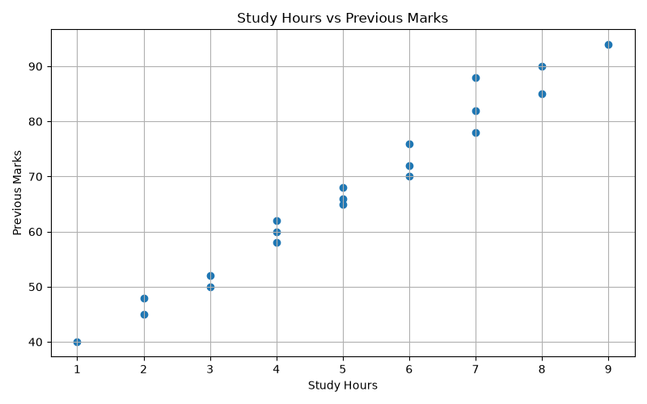

# Smart Student Performance Prediction

A machine learning project that predicts student academic performance based on study hours, attendance, previous marks, and assignment scores.

## 📌 Project Overview

The aim of this project is to build a machine learning model that can classify students into three performance categories:

- Low
- Medium
- High

The project uses a Decision Tree Classifier to learn patterns from student academic data and predict the performance of a new student.

## 🎯 Objectives

- Analyze student academic data.
- Identify important factors affecting performance.
- Train a machine learning classification model.
- Evaluate the model using accuracy, classification report, and confusion matrix.
- Predict the performance of a new student.
- Visualize the relationship between study hours and previous marks.

## 📊 Dataset

The dataset contains the following attributes:

| Feature | Description |
|---|---|
| Study Hours | Number of hours spent studying |
| Attendance | Student attendance percentage |
| Previous Marks | Marks obtained previously |
| Assignment Score | Assignment marks |
| Performance | Target class: Low, Medium, or High |

## 🤖 Machine Learning Model

**Algorithm:** Decision Tree Classifier

The dataset is divided into training and testing sets. The target labels are encoded using `LabelEncoder`.

The model is evaluated using:

- Accuracy
- Precision
- Recall
- F1-score
- Confusion Matrix

## 📈 Result

For the current small demonstration dataset:

**Test Accuracy: 100%**

Example student:

- Study Hours: 7
- Attendance: 90%
- Previous Marks: 80
- Assignment Score: 85

**Predicted Performance: High**

> Note: The dataset used in this project is small and intended for educational demonstration. The reported accuracy should not be interpreted as real-world model performance.

## 📉 Visualization

The project generates a graph showing the relationship between study hours and previous marks.



## 🛠️ Technologies Used

- Python
- Pandas
- Matplotlib
- Scikit-learn
- Decision Tree
- VS Code
- GitHub

## 📂 Project Structure

```text
smart-student-performance-prediction/
│
├── README.md
├── requirements.txt
├── student_performance.csv
├── student_prediction.py
├── results.png
└── .gitignore
